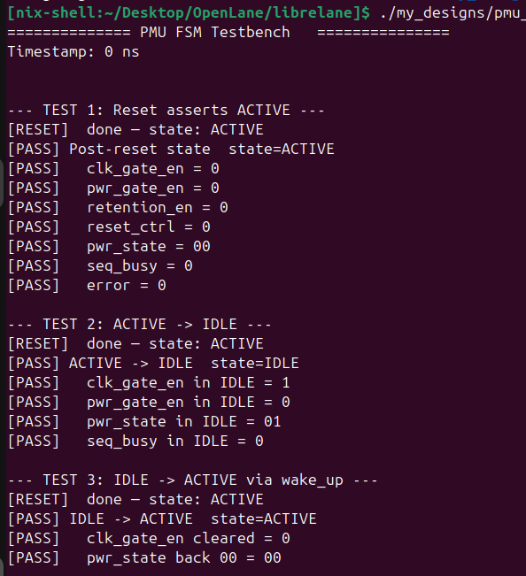
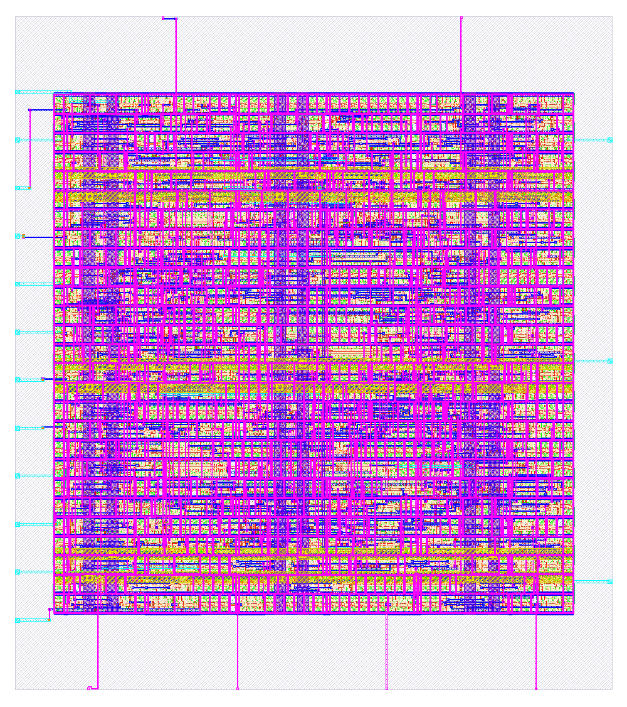
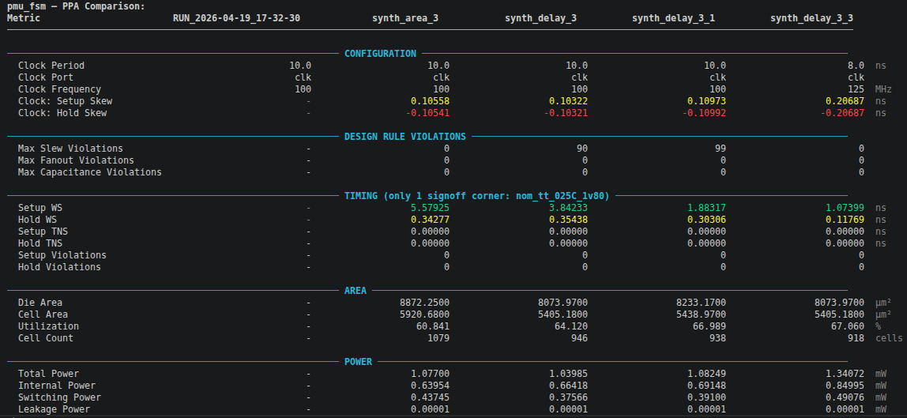
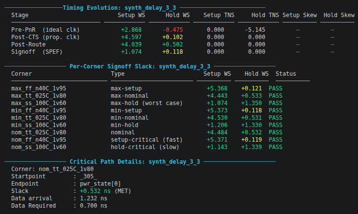

# Power Management Unit FSM - Design
This module implemements a simple Power Management Unit (PMU) Finite State Machine designed for ASIC flow (can be integrated with an SoC for educational learning purposes). It controls power states, clock gating, retention and wake-up sequencing in a robust and synthesis friendly manner. This is a common design pattern in SoC power management, and this implementation is intended to be a comprehensive example of best practices in FSM design, CDC handling, and verification and not a production-ready PMU controller.

# Table of Contents:
1. [Design Overview](#1-design-overview)
2. [Design Details](#2-design-details)
3. [Verification](#3-verification)
4. [Project Structure](#4-project-structure)
5. [Physical Design and Layout](#5-physical-design-and-layout)
6. [Key Findings and Observations](#6-key-findings-and-observations)


 ## 1. Design Overview
 The pmu_fsm coordinates transitions between multiple power modes based on system requests and hardware readiness signals. It is build with:
 * One-hot state encoding - minimizing decoding glitches and improving timing closure
 * Moore machine to avoid combinational hazards
 * all sync inputs are synchronized
 * Deterministic sequencing using timer to ensure safe power transitions

 ### Power States
 The FSM currently supports 7 states: 
| State         | Description |
| --------      | -------- |
| `ACTIVE`      | Full Performance Mode   |
| `IDLE`        | Power On, clock-gated   |
| `SLEEP`       | Power gated with retention   |
| `OFF`         | Full shutdown   |
| `SLEEP_ENT`   | Entry sequence into sleep  |
| `OFF_ENT`     | Entry sequence into off   |
| `WAKE_UP`     | Power/clock restoration sequence   |


**Key idea :**
Entry and wake-up states are explicitly modeled to safely handle sequencing (not merged into main states).


## 2. Design Details

### State Encoding

* One-hot encoding (7-bit)
* Exactly one bit active at any time
* Provides:
    * Simpler combinational logic
    * Better glitch immunity
    * Easier debug and formal verification

### CDC Handling

All async inputs are synchronized using a 2-stage FF syncrhonizer.

* Requests: 
    * `req_idle, req_sleep, req_off, wake_up`
* Status signals: 
    * `pwr_stable, clk_stable, retention_ready`

This prevents metastabilty propagation into the FSM

### Sequencing Mechanism

A `seq_timer` is used to control multi-cycle transitions: 

* Resets on every state transition
* Increments every clock cycle otherwise
* Used to:
    * Delay transitions
    * Time retention save/restore
    * Detect timeout errors

Example:

* Sleep entry waits for retention readiness
* Wake-up waits for power + clock stability

### State Transition Logic
Transitions are determined by: 
* External requests (idle/sleep/off/wake)
* Hardware readiness signals
* Timer thresholds

**Key behaviors:**

* **ACTIVE &rarr; IDLE / SLEEP / OFF**
  * Priority: OFF > SLEEP > IDLE
* **SLEEP_ENT**
  * Wait for `retention_ready`
  * Timeout &rarr; return to ACTIVE + error
* **OFF_ENT**
  * Fixed delay before entering OFF
* **WAKE_UP**
  * Wait for:
    * `pwr_stable`
    * `clk_stable`
  * Restore retention
  * Timeout &rarr; force ACTIVE + error
* **Illegal state recovery**
  * Any invalid encoding &rarr; reset to ACTIVE with error flag

### Output Control Signals

All outputs are registered **(glitch-free)** and derived from the `next state` for alignment.

**Key outputs:**
* **Clock / Power Control**
  * `clk_gate_en`
  * `pwr_gate_en`
* Retention Control
  * `retention_en`
  * `retention_save`
  * `retention_restore`
* DVFS Control
  * `dvfs_ctrl`
  * `11` &rarr; high performance
  * `01` &rarr; low power (sleep)
* Reset Control
  * `reset_ctrl` asserted during **OFF** and early **WAKE_UP**
* State Encoding Output
  * `pwr_state` (2-bit external encoding)
* Status Flags
  * `seq_busy` &rarr; high during transitional states
  * `error` &rarr; timeout or illegal condition detected


## 3. Verification

The testbench [tb_pmu.sv](verify/tb_pmu.sv) provides a comprehensive **functional verification environment** for the [pmu_fsm](src/pmu_fsm.sv) RTL. It is designed to be portable across simulators (Icarus Verilog, Verilator, VCS, Xcelium) and focuses on correctness, robustness, and corner-case validation.

### Testbench Overview

Key Characteristics: 
* Self-checking testbench (no manual waveform inspection required)
* Covers all state transitions, including edge and failure cases
* Models realistic asynchronous behavior using synchronized stimulus
* Includes optional SystemVerilog Assertions (SVA) for formal-like checks
* Generates VCD waveforms for debugging

### DUT Integration

The testbench instantiates the `pmu_fsm` as the DUT:

* All inputs are driven as `logic`
* Outputs are observed via `wire`
* Internal state (`curr_state`) is accessed for verification:

```sv 
wire [6:0] curr_state_raw = dut.curr_state;
```

This enables direct validation of FSM state transitions.

### Clock and Reset
* Clock: 100 MHz (`10 ns period`)
* Reset:
  * Active-low (`reset_n`)
  * Synchronous release after stabilization cycles

```sv
forever #5 clk = ~clk;
```

Reset sequencing ensures:
* Synchronizer pipelines are flushed
* FSM starts deterministically in `ACTIVE`

### CDC-Aware Stimulus

Because the DUT uses **2-stage synchronizers**, inputs must be held long enough to propagate:

```sv
localparam int SYNC_HOLD = 5;
```

This ensures:
* Stage 1 capture
* Stage 2 capture
* Next-state computation
* State register update

A macro simplifies safe stimulus driving:

```sv
`DRIVE(signal, value, hold_cycles)
```

### Helper Tasks

* **Reset handling**
  * `do_reset()`
* **State checking**
  * `check_state(expected, message)`
* **Output checking**
  * `check_out() (1-bit)`
  * `check_out2() (multi-bit)`
* **Wait with timeout**
  * `wait_for_state(target, timeout_cycles)`

Scoreboarding
  * `test_count` &rarr; total checks executed
  * `error_count` &rarr; number of failures

Provides a final pass/fail summary.

### Functional Test Coverage

The testbench includes **14** directed test scenarios:

* Basic Functionality
  * Reset behavior
    * Ensures FSM starts in `ACTIVE`
    * Verifies all outputs are in default state
  * `ACTIVE` &rarr; `IDLE`
  * `IDLE` &rarr; `ACTIVE (wake-up)`
  * Sleep Path
    * `ACTIVE` &rarr; `SLEEP_ENT` &rarr; `SLEEP (normal case)`
    * SLEEP_ENT timeout
      * Missing `retention_ready`
      * Forces recovery to `ACTIVE` + `$error`
  * Power-Off Path
    * `ACTIVE` &rarr; `OFF_ENT` &rarr; `OFF`
    * `OFF` &rarr; `WAKE_UP` &rarr; `ACTIVE` 
  * `SLEEP` &rarr; `OFF` escalation; `req_off` overrrides `req_sleep`
  * `WAKE_UP` timeout
  * DVFS control encoding
  * Retention Save Window
  * `IDLE` &rarr; `SLEEP` direct transition

* Waveform Dump - Can view using GTKWave or Verdi

```sv
$dumpfile("verify/tb_pmu.vcd");
$dumpvars(0, tb_pmu);
```

### How to Run (Simulation)

**Icarus Verilog**
```bash
iverilog -g2012 src/pmu_fsm.v verify/tb_pmu.sv -o verify/sim.out
vvp verify/sim.out
gtkwave verify/tb_pmu.vcd
```

**Verilator**
```bash
verilator --binary -j 0 -Wall --trace --timing --timescale 1ns/1ps -o pmu_sim src/pmu_fsm.sv verify/tb_pmu.sv
./obj_dir/pmu_sim
gtkwave verify/tb_pmu.vcd
```




## 4. Project Structure

```
pmu_fsm/
├── config.yaml              # LibreLane flow configuration
├── src/
│   ├── pmu_fsm.sv           # RTL — one-hot Moore FSM
│   ├── pmu_impl.sdc         # PnR SDC (0.25ns uncertainty)
│   └── pmu_signoff.sdc      # Signoff SDC (0.10ns uncertainty)
├── verify/
│   ├── tb_pmu_fsm.sv        # 14-test SystemVerilog testbench
|   └── tb_pmu.vcd           # Simulation dump file
├── scripts/
│   ├── run_loader.py        # Shared run directory parser (import this)
│   ├── ppa_compare.py       # Cross-run PPA comparison table + CSV export
│   └── timing_analysis.py   # Per-corner slack, critical path, timing evolution
├── runs/
|    ├── synth_area_3/        # SYNTH_STRATEGY AREA 3, 100 MHz
|    ├── synth_delay_3/       # SYNTH_STRATEGY DELAY 3, 100 MHz
|    ├── synth_delay_3_1/     # DELAY 3 + adjusted FP_CORE_UTIL, 100 MHz
|    └── synth_delay_3_3/     # DELAY 3, pushed to 125 MHz (8 ns) to see if it meets timing
├── pin_order.cfg             # pin placement order
└── obj_dir/
      └── pmu_sim/            # design simulation run file

```


## 5. Physical Design and Layout 

The design is taken through the full RTL-to-GDSII flow on **SkyWater 130nm open PDK** using the **LibreLane Classic** flow. This section covers the physical implementation specifics: flow setup, SDC constraints, analysis scripts, and measured PPA results across multiple synthesis strategy sweeps. (More Analysis and sweeps to be added)

###  Flow Configuration

The full RTL-to-GDSII flow is driven by a single `config.yaml` using [LibreLane's](https://librelane.readthedocs.io/en/stable/) Classic flow.

Key configuration decisions:

**Floorplan.** `FP_CORE_UTIL: 40` targets 40% core utilisation, which gives ample routing headroom for a small design. The die is square (`FP_ASPECT_RATIO: 1.0`) with area calculated automatically by LibreLane from the utilisation target.

**Placement density.** `PL_TARGET_DENSITY_PCT` is set 55%, giving the global placer 15% spread above the utilisation floor to prevent congestion.

**Routing.** `RT_MAX_LAYER: met4` reserves met5 for power strap integration in a potential parent chip context. Signal routing uses li1 through met4 only.

**Signoff checks.** All three signoff checks are enabled by default: `RUN_MAGIC_DRC: 1`, `RUN_KLAYOUT_DRC: 1`, `RUN_LVS: 1`. Both DRC tools are run because they catch different classes of violations.

```yaml
# Abbreviated — key parameters
DESIGN_NAME:   pmu_fsm
VERILOG_FILES: dir::src/pmu_fsm.sv
CLOCK_PORT:    clk
CLOCK_PERIOD:  10.0 or 8.0

SYNTH_STRATEGY:   AREA 0 or DELAY 3       # baseline; swept across runs
FP_CORE_UTIL:     40
RT_MAX_LAYER:     met4

```



### SDC Constraints

Two SDC files are used: one for PnR steps and a separate, more realistic one for signoff STA. This is the recommended LibreLane practice — over-constraining during PnR forces the router and CTS engine to build tighter paths, then signoff is evaluated at realistic numbers.

### pmu_impl.sdc (Implementation)

| Parameter | Value | Rationale |
|---|---|---|
| Clock period | 8ns / 10 ns | 125 MHz / 100 MHz target |
| Clock uncertainty | 0.250 ns | Synthetic guard for pre-CTS skew + 0.05 ns ECO margin |
| Output delay (max) | 2.000 ns | Pessimistic: 1.5 ns combo + 0.5 ns downstream setup |
| Output delay (min) | −0.500 ns | Hold guard for downstream FF |
| Max fanout | 8 | Consistent with `MAX_FANOUT_CONSTRAINT` in config |
| Max transition | 0.500 ns | sky130_fd_sc_hd characterisation range |

### signoff.sdc (STA with SPEF)

| Parameter | Value | Rationale |
|---|---|---|
| Clock uncertainty | 0.100 ns | Real CTS built; only jitter (0.05 ns) + OCV (0.05 ns) remain |
| Output delay (max) | 1.500 ns | Realistic: 1.0 ns combo + 0.5 ns downstream setup |
| Output delay (min) | −0.300 ns | Tighter hold guard |

**All 8 async inputs are false-pathed** in both files (`reset_n`, `req_idle`, `req_sleep`, `req_off`, `wake_up`, `pwr_stable`, `clk_stable`, `retention_ready`). These ports connect directly to 2-FF synchronizer chains inside the RTL, so STA on port &rarr; sync_FF paths is not meaningful and would generate spurious violations.


### PPA Analysis Scripts

I designed three python scripts to parse LibreLane run directories and extract structured results. All scripts use stdlib only (no matplotlib, no pandas) and produce colour-coded terminal output plus CSV/text exports.

### `run_loader.py` 

Not run directly. Imported by the other two scripts.

Resolves metrics from two locations in order of preference:
1. `<run_tag>/final/metrics.json` — LibreLane's aggregated metrics output 
2. The last numbered step directory's `state_out.json` (fallback for incomplete runs)

Also loads `resolved.json` (final resolved config) and per-step `state_out.json` files for flow-stage tracking.

Exports all key mappings for timing, area, power, routing, and DRC as named dictionaries (`TIMING_KEYS`, `AREA_KEYS`, `POWER_KEYS`, `ROUTING_KEYS`, `DRC_KEYS`).

```py
from run_loader import load_runs, TIMING_KEYS, AREA_KEYS

runs = load_runs("runs/")                          # all runs
runs = load_runs("runs/", tags=["synth_area_3"])   # specific tags
```

### `ppa_compare.py` 

Prints a sectioned, colour-coded terminal table covering configuration, timing (setup/hold WS, TNS, violations, skew), area (die, cell, utilisation, cell count), power (internal, switching, leakage, total), routing (wirelength, via count, antenna), and DRC (Magic, KLayout, XOR differences). Timing slack is colour-coded green/yellow/red at 0.5 ns thresholds. DRC counts are red if non-zero.


Exports all rows to `runs/ppa_comparison.csv`.

```bash
python3 ppa_compare.py                         
python3 ppa_compare.py runs/ synth_area_3 synth_delay_3
```




### `timing_analysis.py`

Three outputs per run:

**Timing evolution** - shows setup WS, hold WS, TNS, and clock skew at each STA checkpoint through the flow (pre-PnR with ideal clock &rarr; post-CTS with propagated clock &rarr; post-route &rarr; signoff with SPEF). This reveals whether a timing closure issue was introduced at placement, CTS, or routing.

**Per-corner signoff table** - covers all 9 sky130 PVT corners. The `max_ss_100C_1v60` (Slow-Slow, High-Temp, Low Voltage) corner is the worst-case setup corner and the primary tape-out criterion.

**Critical path details** - parses OpenSTA `.rpt` files from the nominal corner's report directory, extracting startpoint, endpoint, slack value, data arrival time, and clock network delay.


```bash
python3 timing_analysis.py runs/
python3 timing_analysis.py runs/ synth_delay_3_3
```



### Experimental Runs

Four runs were executed varying `SYNTH_STRATEGY` and clock period to explore the PPA trade-space.

| Run Tag | `SYNTH_STRATEGY` | Clock Period | Notes |
|---|---|---|---|
| `synth_area_3` | `AREA 3` | 10 ns / 100 MHz | Aggressive area minimisation |
| `synth_delay_3` | `DELAY 3` | 10 ns / 100 MHz | Delay-driven synthesis, baseline |
| `synth_delay_3_1` | `DELAY 3` | 10 ns / 100 MHz | Adjusted `FP_CORE_UTIL`, `MAX_FANOUT`, `PL_RESIZER_HOLD_SLACK_MARGIN` |
| `synth_delay_3_3` | `DELAY 3` | 8 ns / 125 MHz | Frequency push to 125 MHz |

All four runs passed DRC (Magic and KLayout: 0 errors), LVS, and routing DRC cleanly. All runs closed timing with positive setup and hold slack.

### Area and Cell Count

| Run | Die Area (µm²) | Core Area (µm²) | Std Cells | Utilisation |
|---|---|---|---|---|
| `synth_area_3` | 8872.25 | 5920.68 | 379 | 60.84% |
| `synth_delay_3` | 8073.97 | 5405.18 | 355 | 64.12% |
| `synth_delay_3_1` | 8233.17 | 5438.97 | 374 | 66.99% |
| `synth_delay_3_3` | 8073.97 | 5405.18 | 365 | 67.06% |


`synth_delay_3` and `synth_delay_3_3` share identical die and core area because `synth_delay_3_3` reuses the same floorplan geometry — only the clock period in the SDC changes, not the physical floor.

###  Timing

All runs target a 10 ns clock period (100 MHz) except `synth_delay_3_3` which runs at 8 ns (125 MHz). Positive worst-case slack (WS) in all cases means timing is closed at signoff.

| Run | Period | Setup WS (ns) | Hold WS (ns) | Setup TNS | Skew (ns) |
|---|---|---|---|---|---|
| `synth_area_3` | 10 ns | +5.579 | +0.343 | 0.000 | 0.1056 |
| `synth_delay_3` | 10 ns | +3.842 | +0.354 | 0.000 | 0.1032 |
| `synth_delay_3_1` | 10 ns | +1.883 | +0.303 | 0.000 | 0.1097 |
| `synth_delay_3_3` | 8 ns | +1.074 | +0.118 | 0.000 | 0.2069 |


`synth_area_3` shows unusually large setup slack (+5.58 ns on a 10 ns clock) because the AREA 3 strategy produces more logic depth per gate, which paradoxically leaves more slack in a low-fanout PMU design. The `synth_delay_3_3` run at 125 MHz closes with only +1.07 ns setup margin — further frequency push would require a higher-drive synthesis strategy or tighter placement constraints.

Hold slack narrows from +0.354 ns at `synth_delay_3` to +0.118 ns at 125 MHz. The 125 MHz run is still comfortably passing hold, but continued frequency increase would require explicit hold buffer insertion via `PL_RESIZER_HOLD_SLACK_MARGIN`.

### Power

Power reported at nominal corner (tt, 25°C, 1.8V), activity factor 0.10.

| Run | Total (mW) | Internal (mW) | Switching (mW) | Leakage (nW) |
|---|---|---|---|---|
| `synth_area_3` | 1.077 | 0.640 | 0.437 | 6.99 |
| `synth_delay_3` | 1.040 | 0.664 | 0.376 | 5.58 |
| `synth_delay_3_1` | 1.082 | 0.691 | 0.391 | 5.48 |
| `synth_delay_3_3` | 1.341 | 0.850 | 0.491 | 5.54 |

<!-- IMAGE PLACEHOLDER -->
<!-- Recommended: stacked bar chart — internal + switching + leakage per run -->
<!-- File: docs/images/power_breakdown.png -->
<!--  -->

The 125 MHz run (`synth_delay_3_3`) draws 1.341 mW — approximately **24% more total power** than the 100 MHz baseline (`synth_delay_3`). This is the expected dynamic power scaling with frequency at constant voltage. The switching component (+31% vs baseline) scales almost linearly with clock frequency.

### Routing

| Run | Wirelength (µm) | Via Count | Antenna Viols | Route DRC |
|---|---|---|---|---|
| `synth_area_3` | 5437 | 1774 | 0 | 0 |
| `synth_delay_3` | 6486 | 1937 | 0 | 0 |
| `synth_delay_3_1` | 6043 | 1946 | 0 | 0 |
| `synth_delay_3_3` | 6303 | 1956 | 0 | 0 |

`synth_area_3` has the shortest total wirelength (5437 µm) and fewest vias (1774) because the area-optimised netlist produces more compact placement. The DELAY strategy runs have ~19% more wirelength on average, which is the trade-off: delay-optimised synthesis creates a more spread-out netlist to minimise logical depth, which the placer maps to longer physical wires.


### Max Slew Violations

| Run | Max Slew Violations |
|---|---|
| `synth_area_3` | 0 |
| `synth_delay_3` | 90 |
| `synth_delay_3_1` | 99 |
| `synth_delay_3_3` | 0 |

`synth_delay_3` and `synth_delay_3_1` show slew violations (90 and 99 respectively) at 100 MHz. These are post-route violations where certain nets have transition times exceeding the 0.5 ns limit set in the SDC. The 125 MHz run has 0 because the tighter timing constraint forces OpenROAD's resizer to upsize drivers more aggressively during CTS and post-route repair. 

Delay-optimised synthesis at a relaxed clock period can leave some high-fanout nets under-driven because the timing constraint is not tight enough to trigger resizer intervention.

**Fix for `synth_delay_3`/`synth_delay_3_1`:** reduce `PL_RESIZER_TIMING_OPTIMIZATIONS` threshold or set `set_max_transition 0.4` in `pmu_impl.sdc` to trigger resizer on more nets.


## 6. Key Findings and Observations

**Area vs. timing trade-off.** `SYNTH_STRATEGY AREA 3` produces a *9.8%* larger die than `DELAY 3` but delivers nearly *1.7 ns more setup margin* at the same clock period. For a PMU block where area is the priority and 100 MHz is ample margin, `DELAY 3` is the better choice — but the slew violations it introduces must be addressed before tape-out.

**Power at 125 MHz.** The *24% power increase* vs. *100 MHz* is almost entirely dynamic (internal + switching). Leakage is essentially constant across all runs (5–7 nW), as expected for a design with identical cell geometries. For an always-on PMU controller, power budget is critical — whether 1.34 mW is acceptable will depend on the overall SoC power envelope.

**Slew violations in delay-optimised runs.** The 90–99 slew violations in `synth_delay_3` and `synth_delay_3_1` are a quality concern even though timing WS is positive. Slew violations cause increased power consumption and can affect signal integrity in adjacent metal layers. These should be resolved by tightening `set_max_transition` in `pmu_impl.sdc` from 0.5 ns to 0.35 ns and re-running.

